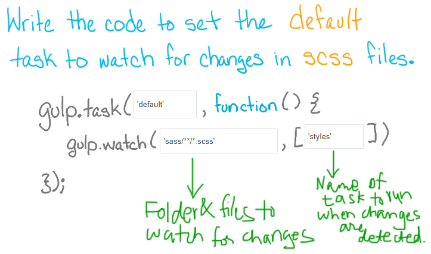

# gulp
Gulp is a task runner, it is a tool for building js applications.
Gulp is installed with NPM and NPM comes with Node.js
Node Package Manager - NPM

Gulp does the annoying repetitive and time consuming tasks,
gulp has its own ecosystem with 100s of plugins for taking care of these tasks.
Some of the tasks which gulp performs are:
Minifying scripts & styles
 Concatenation
Cache busing - which has to do with letting the browser know if there is a
new version of a cached file
Testing, Linting, Error checking and Optimization
Dev Servers
All the helpful debugging tasks are done by Gulp
Gulp is built on top of node streams and a node stream is a continuous flow of data that can be manipulated asynchronously - Other build systems like Grunt, perform tasks by copying their files to a temporary place where they make some change on them. As a result every task incurs a penalty for I/O in file system operations. Gulp on the other hand, converts your input files into an IN MEMORY stream - So the I/O is only done initially, and at the very end of all tasks. That is what gives Gulp such a great speed increase in many situations.

Grunt is about configuration.
Gulp is about code.

Gulp tasks are coded using node style syntax while grunt is configuration over code - meaning that the tasks are configured inside a configuration object inside of the grunt file.

First Install NODE.JS
Open Command Prompt
To Install gulp globally
npm install -g gulp
To create a directory
mkdir nameOfYourDirectory
To change directory
cd  nameOfYourDirectory
Open your directory in Sublime
Now we will create a package.json file in our directory - which is kind of like a manifest file which will hold all our application metadata as well as the dependencies and all that.
To create that easily we can just do
npm init (to initialize our package.json and it will prompt some questions and we can answer them or leave them to default- like name, description etc).
This will create a package.json file inside our directory which has all the information we provided.
Now we need Install gulp locally.
npm install (Don't hit enter yet, see next)
Gulp is not something we use in production, So we need to install gulp locally and save it as a dev dependency(development dependency).
To do that we do
npm install --save-dev gulp
This adds gulp under devdependencies inside our package.json file AND this creates a folder called node_modules which contains all the node modules for gulp
Now we will create two folders src, dist or build or public.
the src folder is where we will put all our source code before it gets compiled - we will put everything in src folder and then all of our tasks that we run in gulp it is going to go through and it is going to compile it and put it in the directory called dist or build or public or whatever you name it. The dist folder is basically your production application that you would actually up deploy to your server.
Now we also need a file in our root directory called gulpfile.js
This has to be named exactly gulpfile.js
This is where we describe all of our tasks, everything we want gulp to do.
Now open the gulpfile.js
const gulp = require('gulp');

/*
--Top Level Functions--
gulp.task - Define tasks
gulp.src - Point to files to use
gulp.dest - Points to  folder to output
gulp.watch - watch files and folders for changes
*/

/*Logs Gulp is running... when you call the command
gulp message
in your command line */
gulp.task('message', function(){
	return console.log('Gulp is running...');
});

/*Logs This is your Default message when you call the command
gulp
in your command line */
gulp.task('default', function(){
	return console.log('This is your Default message');
});

gulp.task('copyHTML', function(){
	gulp.src('src/*.html') // This is the source from where we are taking any files with the extension of html
	.pipe(gulp.dest('dist')); /* Now we are piping those files into a destination
	folder called dist. If we haven't created a folder called dist,
	running this task in the command prompt automatically creates a folder
	called dist and copies the html files into them */
});

